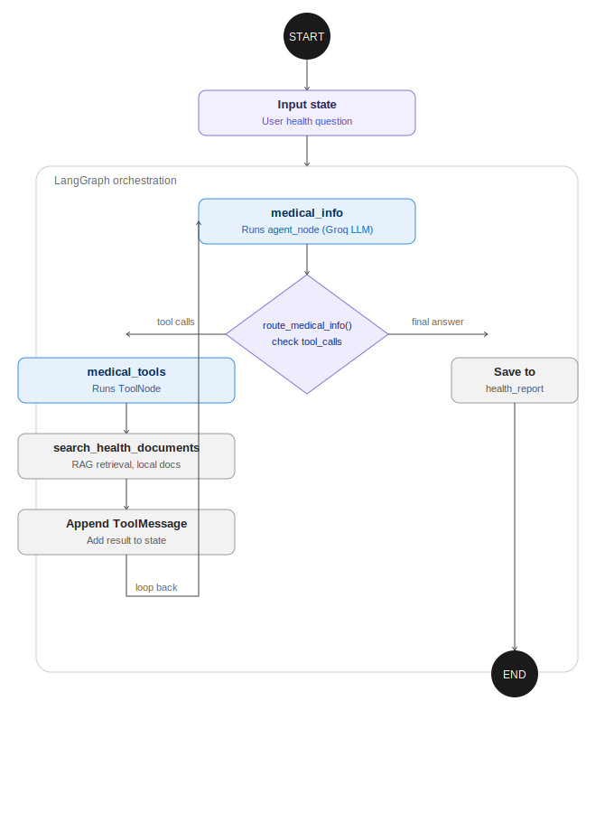

# Healthcare Monitoring AI Agent — Track B

**Checkpoint: Week 3-4, Single-Agent Milestone**

## Progress Today

- [x] Backend structure set up (`App/agents`, `App/rag`, `App/tools`, `data/documents`)
- [x] Dependencies installed (`requirements.txt`)
- [x] Single agent built and working end-to-end: **MedicalInfoAgent**
- [x] RAG chain implemented over local health documents (`App/rag/rag_chain.py`)
- [x] LangGraph workflow (`workflow.py`) wired for the single agent, with tool-calling loop

Additional agents (medication tracking, fitness data, symptom triage, etc.) will be added as separate nodes in `workflow.py` in the next milestone, following the same `agent_node` / `tool_node` pattern.

## Workflow Diagram



## Architecture

```
App/
├── agents/
│   └── medical_info_agent.py   # MedicalInfoAgent: agent_node (LLM) 
├── rag/
│   └── rag_chain.py            # Local RAG: TF-IDF embeddings + FAISS vectorstore
├── tools/
│   └── medical_tools.py        # search_health_documents tool (wraps RAG chain)
data/
└── documents/                  # Local knowledge base (diabetes, hypertension,
                                 # cold/flu, medication safety, nutrition)
workflow.py                     # LangGraph StateGraph orchestrating the agent
```

### How the RAG chain works
1. Local `.md` documents in `data/documents/` are loaded and chunked (`RecursiveCharacterTextSplitter`).
2. Chunks are embedded with a **local TF-IDF vectorizer** (scikit-learn) — no external embedding API/key needed, so it runs fully offline.
3. Chunks are indexed in an in-memory **FAISS** vectorstore.
4. `search_health_documents` (a LangChain `@tool`) retrieves the top-k relevant chunks for a query and returns them, with source attribution, for the LLM to ground its answer on.

### How the agent works
`MedicalInfoAgent.agent_node` invokes a Groq-hosted LLM with the RAG tool bound. The system prompt requires the model to search the local documents before answering, avoid diagnosing, and include a medical disclaimer. `route_medical_info` checks whether the LLM asked for a tool call: if so, the graph loops to `medical_tools` (a `ToolNode`) and back; otherwise the response is saved to `state["health_report"]` and the graph ends.

## Setup

```bash
git clone <your-repo-url>
cd healthcare-ai-agent
pip install -r requirements.txt
cp .env.example .env   # then add your GROQ_API_KEY (free at console.groq.com)
python workflow.py
```
