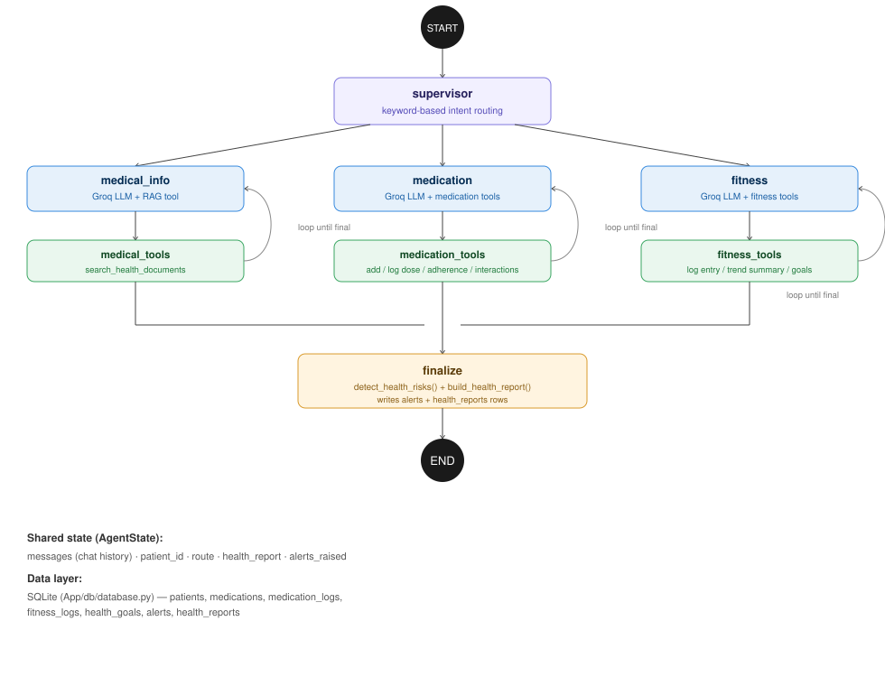

# Healthcare Monitoring AI Agent — Track B

## Progress

- [x] Backend structure (`App/agents`, `App/rag`, `App/tools`, `App/db`, `data/documents`)
- [x] **3-agent LangGraph workflow** with a supervisor router (`workflow.py`):
  - `medical_info` — RAG-grounded general health Q&A (unchanged from last checkpoint)
  - `medication` — add/track medications, log doses, adherence rate, basic interaction checks
  - `fitness` — log fitness/sleep entries, trend summaries (linear regression), goal tracking
- [x] **7-table SQLite schema** (`App/db/database.py`): patients, medications,
      medication_logs, fitness_logs, health_goals, alerts, health_reports
- [x] **Rule + trend-based risk engine** (`App/tools/analytics_tools.py`):
      adherence threshold, missed-dose streaks, sleep threshold, declining-activity
      trend via `numpy.polyfit` — writes to the `alerts` table
- [x] **Automated health report generation**, aggregating meds + fitness + goals +
      alerts into one saved, downloadable report
- [x] **Streamlit dashboard** (`streamlit_app.py`): chat + medications + fitness
      charts + goals + alerts + report export, backed directly by SQLite
- [x] Updated workflow diagram (`docs/workflow_diagram.svg`) and architecture/privacy
      notes (`docs/architecture.md`)
- [x] **Role-based access** (`App/auth.py`, `App/db/database.py` `users` table):
      username + role login (no passwords — see `docs/architecture.md` for the
      scope trade-off). Patient gets full read/write on their own record; Doctor
      can view any patient's record but doesn't log doses on their behalf;
      Caregiver gets a view-only monitoring dashboard (alerts, adherence, fitness,
      report) with no chat and no logging.

See `docs/architecture.md` for the design decisions (why keyword routing, why
SQLite over Postgres/Redis, why regression instead of a trained ML model) and
what's explicitly still out of scope (role-based auth, voice/image bonus
features, HIPAA-grade infra) — written up front rather than silently skipped.

## Technical areas I worked with

Python · LangGraph · LangChain · Groq · FAISS · TF-IDF · SQLite · NumPy · Streamlit

## Workflow Diagram



## Architecture

```
App/
├── agents/
│   ├── supervisor.py            # keyword-based intent router
│   ├── medical_info_agent.py    # MedicalInfoAgent (RAG-grounded)
│   ├── medication_agent.py      # MedicationAgent
│   └── fitness_agent.py         # FitnessAgent
├── rag/
│   └── rag_chain.py             # Local RAG: TF-IDF embeddings + FAISS
├── tools/
│   ├── medical_tools.py         # search_health_documents
│   ├── medication_tools.py      # add/log/adherence/interactions
│   ├── fitness_tools.py         # log/summary/goals
│   └── analytics_tools.py       # risk detection + report generation
└── db/
    └── database.py              # SQLite schema + CRUD (7 tables)
data/
├── documents/                   # Local knowledge base (5 markdown files)
└── health_data.db               # gitignored local dev DB, created on first run
workflow.py                      # LangGraph multi-agent StateGraph
streamlit_app.py                 # Patient-facing dashboard
docs/
├── workflow_diagram.svg
└── architecture.md
```

### How a request flows

1. `supervisor` reads the latest user message and routes it to `medical_info`,
   `medication`, or `fitness` based on keyword hits (see `App/agents/supervisor.py`
   for why this is keyword-based rather than an extra LLM call).
2. The chosen agent invokes a Groq-hosted LLM with its own tools bound. If the
   LLM requests a tool call, the graph loops through that agent's `ToolNode`
   and back until it has a final answer.
3. Every path converges on `finalize`, which runs `detect_health_risks()` (rule
   + trend-based checks, writing any new alerts) and `build_health_report()`
   (aggregates medications/fitness/goals/alerts into one saved report).

### How the RAG chain works (medical_info agent)

Local `.md` documents are chunked, embedded with a local TF-IDF vectorizer
(no external embedding API/key needed), and indexed in an in-memory FAISS
store. `search_health_documents` retrieves the top-k relevant chunks with
source attribution for the LLM to ground its answer on.

## Setup

```bash
git clone <your-repo-url>
cd healthcare-ai-agent
pip install -r requirements.txt
cp .env.example .env   # then add your GROQ_API_KEY (free at console.groq.com)

# CLI demo (medical-info + medication + fitness queries against a demo patient)
python workflow.py

# Full dashboard
streamlit run streamlit_app.py
```

The Groq agent uses `openai/gpt-oss-20b`; the previous `llama-3.1-8b-instant`
model was deprecated by Groq on August 16, 2026.

The Medications, Fitness, Goals, and Alerts tabs in the dashboard work
directly against the local SQLite store with no API key required — only the
Chat tab needs `GROQ_API_KEY`.

## Remaining for Week 7–8 (Polish & Production)

- [x] Deploy-ready Streamlit dashboard (see `DEPLOYMENT.md`)
- [ ] Performance pass on the RAG index for a larger document set
- [ ] Technical blog post + API documentation (Track B submission requirement)
- [ ] Final demo video (8–10 minutes) and viva prep using `docs/architecture.md`

## Notes

- **Never enter real patient data.** `data/health_data.db` is a local dev
  database for demo/mock patients only, and is gitignored.
- `check_drug_interactions` uses a small illustrative reference list, not a
  full clinical drug database — always confirm with a pharmacist or doctor.
- All medical-info answers are grounded in the local documents and carry a
  disclaimer; the agent never diagnoses.
